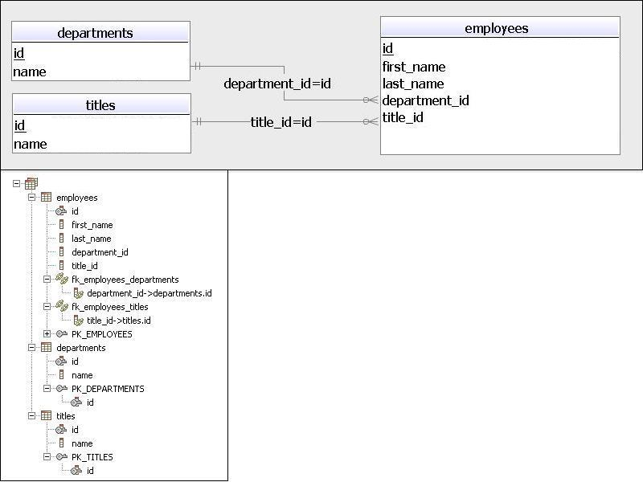
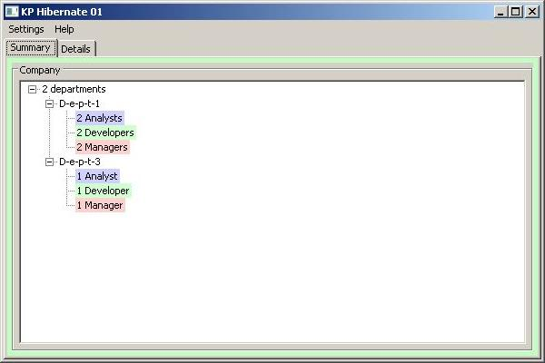

<!DOCTYPE html>
<HTML>
<HEAD>
	<META charset="UTF-8">
</HEAD>
<BODY>
<H2>KP_Hibernate01 README</H2>

This is a rich client (fat client) application example.

<H2>Use Cases</H2>
<UL>
<LI/><B>Show summary</B>: tree view of the company's departments and number of its employees grouped by titles
<LI/><B>Show details</B>: table view of the company's departments and its employees
<LI/><B>Update department</B>: edit and update the information about a department
<LI/><B>Add department</B>: add a new department to the company
<LI/><B>Delete department</B>: delete existing department (with its employees) from the company
<LI/><B>Update employee</B>: update and edit the information about an employee
<LI/><B>Add employee</B>: add a new employee to the department
<LI/><B>Delete employee</B>: delete the employee from the department
<LI/><B>Join departments</B>: join two departments moving employees from the second department to the first department
</UL>

 
 
<a href="http://htmlpreview.github.io/?https://github.com/k1729p/legacy/blob/main/KP_Hibernate01/docs/apidocs/index.html">
Java API Documentation</a> 

<H2>Application Design & Implementation</H2>

<H3>Build Process</H3>

The application uses the build automation tool <B>Apache Maven 3</B>.

<H3>Database Technology</H3>

The application uses <B>MySQL 5.7</B> relational database for data storage.

<H3>Logging</H3>

The application uses standard java loggers.

<H3>Business / Persistence Layer</H3>

The Persistence Layer is configured to use the <B>MySQL</B> database with <B>Hibernate 5</B>.

<H3>Presentation Layer</H3>

The application uses Eclipse Standard Widget Toolkit.

<H2>Database Model Diagram</H2>
 

<H2>Application Screens</H2>

 
Summary Tree

 
Details Tables

 
Departments Popup Menu

 
Edit Department Dialog

 
Employees Popup Menu

 
Edit Employee Dialog

 
Summary before "Join Departments" Execution 
In the menu selected "Join Departments" menu item

 
Summary after "Join Departments" Execution

 
Details after "Join Departments" Execution 
Employees table sorted by "Title" column.

<a href="#top">Back to the top of the page</a>

</BODY>
</HTML>