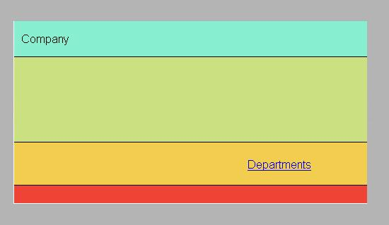
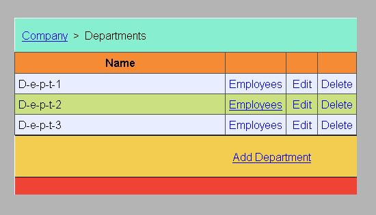
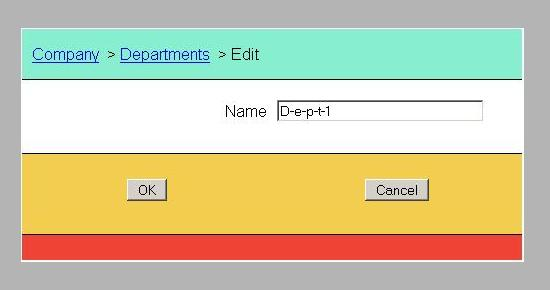
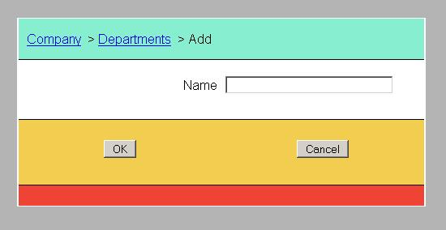
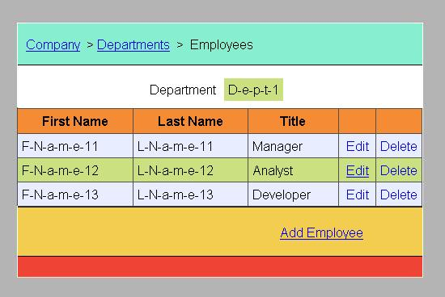
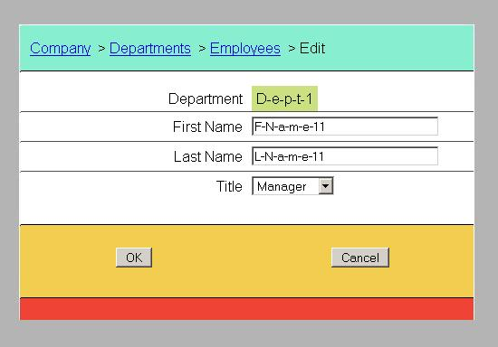
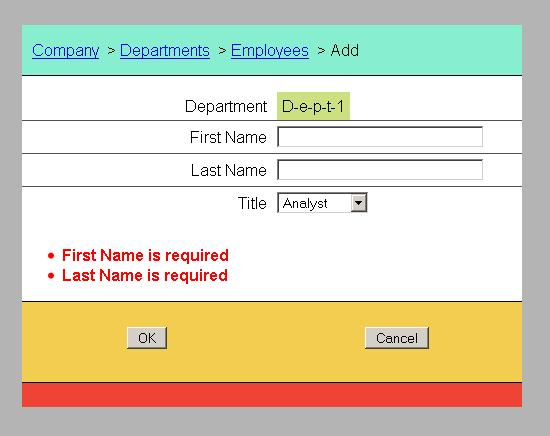

<!DOCTYPE html>
<HTML>
<HEAD>
	<META charset="UTF-8">
</HEAD>
<BODY>

<H2>KP_Hibernate02 README</H2>

This is a <B>JavaServer Faces</B> web application example.

<H2>Use Cases</H2>
<UL>
  <LI/><B>Company</B>: welcome page
  <LI/><B>Show departments</B>: table view of the company's departments and links to its employees
  <LI/><B>Edit the existing department</B>: edit and update the information about a department
  <LI/><B>Add a new department</B>: add a new department to the company
  <LI/><B>Delete the department</B>: delete the existing department (with its employees) from the company
  <LI/><B>Show employees</B>: table view of selected department employees
  <LI/><B>Edit the existing employee</B>: update and edit the information about an employee
  <LI/><B>Add a new employee</B>: add a new employee to the department
  <LI/><B>Delete the employee</B>: delete an employee from the department
</UL>

 
 
<a href="http://htmlpreview.github.io/?https://github.com/k1729p/legacy/blob/main/KP_Hibernate02/docs/apidocs/index.html">
Java API Documentation</a> 

<H2>Application Design & Implementation</H2>

<H3>Build Process</H3>

The application uses the build automation tool <B>Apache Maven 3</B>. 
The application was tested with web servers <B>Tomcat 9</B> and <B>Jetty 9</B>. 
The application URL: <B>http://localhost:8080/kp_hibernate02/</B>. 

<H3>Testing</H3>

The application runs test cases for <B>JUnit 4</B>.

<H3>Database Technology</H3>

The application uses <B>MySQL 5.7</B> relational database for data storage.

<H3>Logging</H3>

The application uses standard java loggers.

<H3>Business / Persistence Layer</H3>

The Persistence Layer is based on <B>Hibernate 5</B> and <B>MySQL</B> database. 
It uses <B>Hibernate Annotations</B> and  <B>Hibernate EntityManager</B>. 
<B>Hibernate EntityManager</B> implements the programming interfaces and lifecycle rules as defined by the <B>JPA 2.1</B> specification. 
The database connection pool is configured with library <B>C3P0</B>.

<H3>Presentation Layer</H3>

The application uses <B>JavaServer Faces 2.2</B> web application framework and <B>Facelets</B> (JSF View Definition Framework). 
<UL>
  <LI/>Location-based breadcrumb website navigation
  <LI/>Templates with Facelets templating framework
  <LI/>Composition components with Facelets tag library
</UL>

<H2>Database Model Diagram</H2>
 

<H2>Application Screens</H2>

 
Welcome page of the application. Overview of the company.

 
Listing all departments.

 
Editing the existing department.

 
Adding a new department.

 
Listing all employees of the selected department.

 
Editing the existing employee.

 
Adding a new employee.

<a href="#top">Back to the top of the page</a>

</BODY>
</HTML>