<!DOCTYPE html>
<HTML>
<HEAD>
	<META charset="UTF-8">
</HEAD>
<BODY>

<H2>KP_Seam01 README</H2>

This is a <B>CDI 2.0</B> (Contexts and Dependency Injection for the Java EE platform) web application example. It is composed of three parts:

<UL>
  <LI/>Manage departments and their employees (<B>C</B>reate, <B>R</B>ead, <B>U</B>pdate, <B>D</B>elete)
  <LI/>Show reports by XML Web Services
  <LI/>Show reports by RESTful Web Services
</UL>

<I>JBoss EAP 7.1 uses CDI reference implementation Weld 2.4.3.Final.</I>

<H2>Use Cases</H2>
<TABLE BORDER=1>
  <TR><TD><B>Company</B></TD><TD>welcome page</TD></TR>
  <TR><TD><B>Show departments</B></TD><TD>table view of the company's departments and links to its employees</TD></TR>
  <TR><TD><B>Show employees</B></TD><TD>a table view of selected department employees</TD></TR>
  <TR><TD><B>Edit the existing employee</B></TD><TD>edit the information about an employee</TD></TR>
  <TR><TD><B>Update the existing employee</B></TD><TD>update the information about an employee</TD></TR>
  <TR><TD><B>Delete the employee</B></TD><TD>delete employee from the department</TD></TR>
  <TR><TD><B>Add a new employee</B></TD><TD>add a new employee to the department</TD></TR>
  <TR><TD><B>Edit the existing department</B></TD><TD>edit the information about a department</TD></TR>
  <TR><TD><B>Update the existing department</B></TD><TD>update information about a department</TD></TR>
  <TR><TD><B>Delete the department</B></TD><TD>delete existing department (with its employees) from the company</TD></TR>
  <TR><TD><B>Add a new department</B></TD><TD>add a new department to the company</TD></TR>
  <TR><TD>&nbsp;</TD><TD>&nbsp;</TD></TR>
  <TR><TD><B>Show reports (XML Web Services)</B></TD><TD>query departments and employees</TD></TR>
  <TR><TD><B>Show reports (RESTful Web Services)</B></TD><TD>query departments and employees</TD></TR>
</TABLE>
<H2>Use Case Diagram</H2>
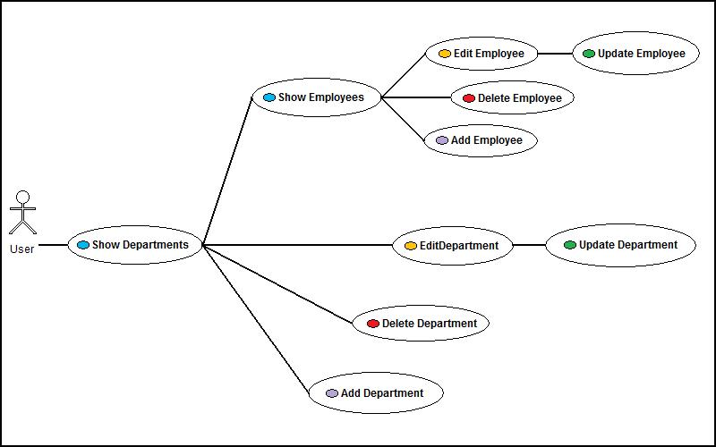 

 
 module 'ejb': 
<a href="http://htmlpreview.github.io/?https://github.com/k1729p/legacy/blob/main/KP_Seam01/KP_Seam01-ejb/docs/apidocs/index.html">
Java API Documentation</a> 
 module 'web': 
<a href="http://htmlpreview.github.io/?https://github.com/k1729p/legacy/blob/main/KP_Seam01/KP_Seam01-web/docs/apidocs/index.html">
Java API Documentation</a> 

<H2>Application Design &amp; Implementation</H2>
<H3>Architecture</H3>

This is simplified, flat architecture without any intermediate service or DAO tiers.
<B>EJB 3.2</B> and <B>JPA 2.2</B> are used directly with <B>JSF 2.3</B>. 
There is one database layer and one combined layer for presentation, business logic, and persistence.

<H3>Build Process</H3>

The application uses the build automation tool <B>Apache Maven 3</B>. 
The application was built with <B>Java 8</B> and tested with <B>JBoss EAP 7.1</B> and <B>WildFly 11.0</B>. 
The application URL: <A href="http://localhost:8080/KP_Seam01/" ><B>http://localhost:8080/KP_Seam01/</B></A>. 

<H3>Database Technology</H3>

The application uses <B>MySQL 5.7</B> relational database for data storage.

<H3>Logging</H3>

The application uses standard java loggers.

<H3>Business / Persistence Layer</H3>

The Persistence Layer is based on <B>EJB</B> and <B>MySQL</B> database. 
<I>JBoss EAP 7.1 uses Hibernate 5.1.10.Final as a JPA provider.</I>

The database queries use the Criteria API (type-safe criteria queries with entity’s metamodel class). 
The data validation is based on Bean Validation API 2.0. The validating annotations are included in the entity beans.

<H3>Presentation Layer</H3>

The application uses the <B>JavaServer Faces</B> web application framework. 
<UL>
  <LI/>Facelets (JSF View Definition Framework) as a view handler
  <LI/>Location-based breadcrumb website navigation
  <LI/>Facelets templating framework
  <LI/>Facelets composite components
</UL>
The managed beans are annotated with various scopes: 
<UL>
  <LI/>Department and employee managed beans (backing beans) use <B>conversation</B> scope
  <LI/>Department and employee list producers use <B>request</B> scope
  <LI/>Title list producer uses <B>session</B> scope
</UL>

<H3>XML Web Services Client and Server</H3>

It uses JAX-WS 2.3 (Java API for XML-Based Web Services). 
<I>JBoss EAP 7.1 uses JBossWS. It provides most of the features coming with Apache CXF.</I>

<H3>RESTful Web Services Client and Server</H3>

It uses JAX-RS 2.1 (Java API for RESTful Web Services). 
<I>JBoss EAP 7.1 uses JAX-RS implementation RESTEasy 3.0.24.Final.</I>

JAX-RS is activated with the "no XML" approach by subclassing "javax.ws.rs.core.Application" and annotating code with @ApplicationPath. 
Reports are retrieved with HTTP GET request method. 

<TABLE BORDER=1>
  <TR><TD><B>Report</B></TD><TD><B>MIME Media Type</B></TD></TR>
  <TR><TD>Departments</TD><TD>XML</TD></TR>
  <TR><TD>Employees</TD><TD>XML</TD></TR>
  <TR><TD>All titles</TD><TD>JSON</TD></TR>
  <TR><TD>Selected title</TD><TD>JSON</TD></TR>
  <TR><TD>Employee count</TD><TD>HTML</TD></TR>
</TABLE>

<H2>Database Model Diagram</H2>
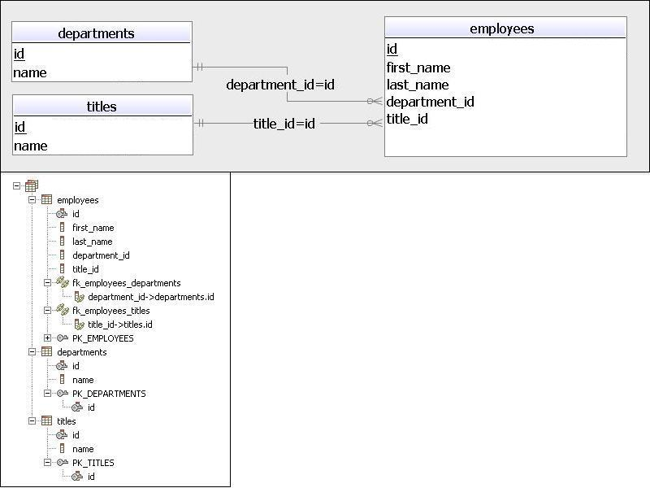 

<H2>Application Screens</H2>

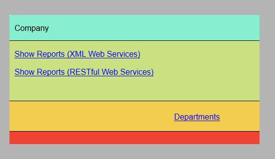 
Welcome page of the application. Overview of the company.

 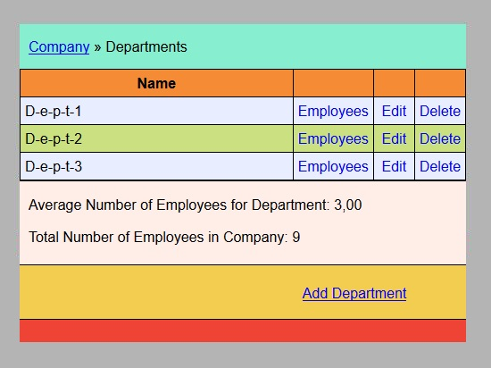 
Listing all departments.

 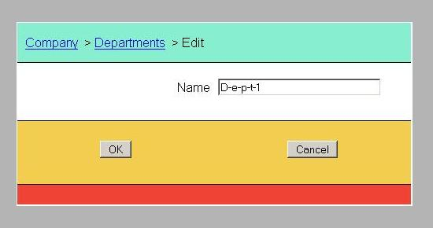 
Editing the existing department.

 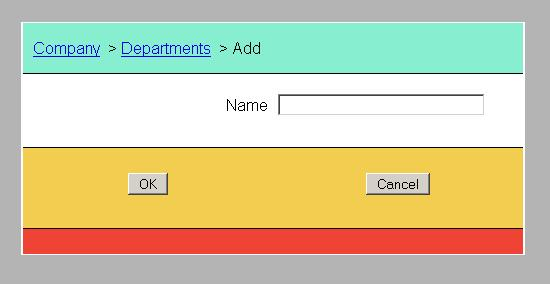 
Adding a new department.

 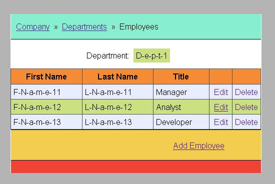 
Listing all employees of the selected department.

 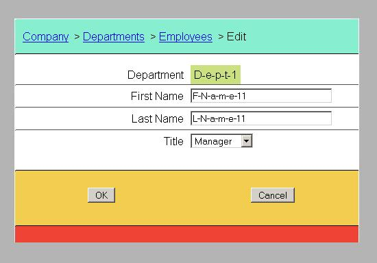 
Editing the existing employee.

 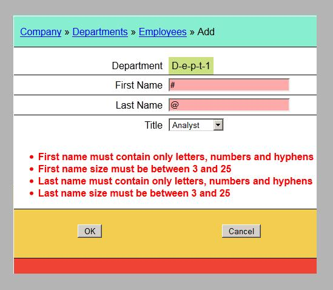 
Adding a new employee. Displayed validation messages.

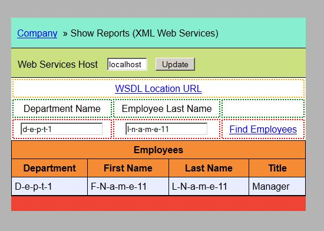 
XML Web Services Client. Displayed query results in the table "Employees".

 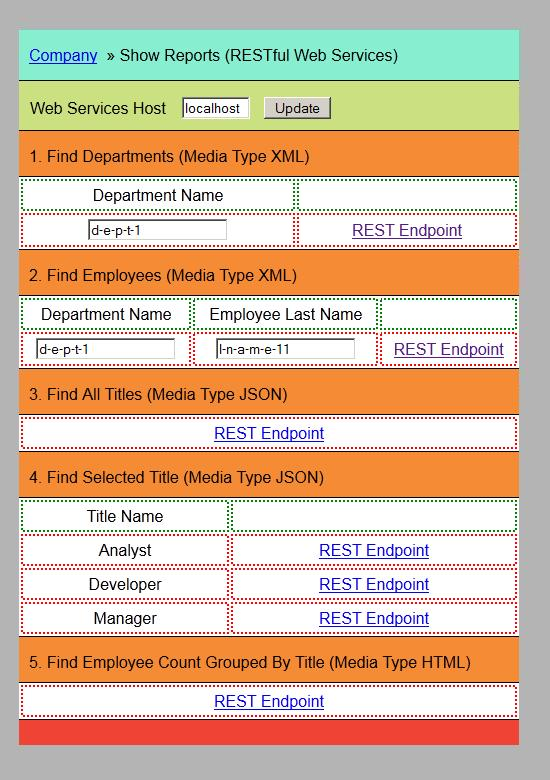 
RESTful Web Services Client. On this page, there are links to the REST endpoints.

<I>The application architecture is based on the Maven archetype: "kitchensink" example from JBoss AS 7 Quickstart examples.</I>

<a href="#top">Back to the top of the page</a>

</BODY>
</HTML>